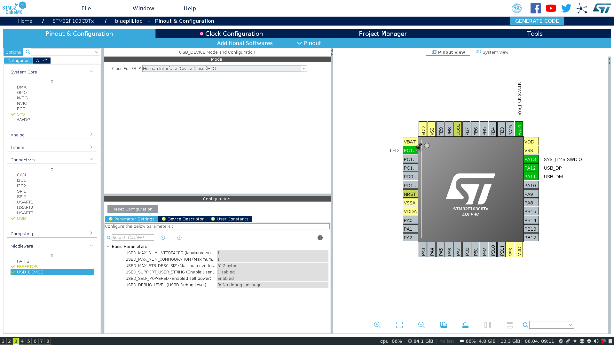
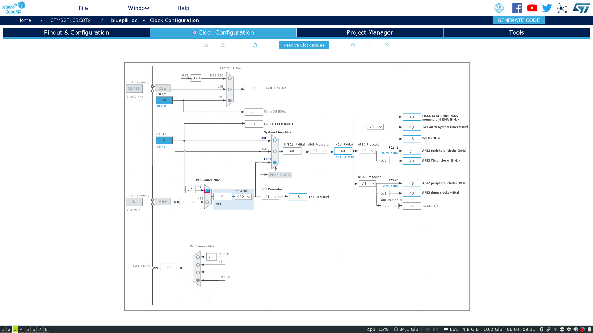

# Cube MX HID

The first step to using the bluepill with USB is to enable the appropriate components and set the clock correctly to generate the required 48MHz clock.

The configuration is quite easy, in connectivity enable USB as a full speed device, you shouldn't need to change any configurations of the USB. Then in middleware, after enabling `USB_DEVICE`, select the "Class for FS IP" to be "Human Interface Device Class (HID)". Avoid selecting the custom HID for now as this is more work to set up and for this basic example we will stick with their generated example (mouse) for now.



After enabling USB we must configure the board such that we have a correct clock on the USB lines to enable data transfer. The automatic clock resolved from Cube is usually pretty good but in this case it sucked and I had to find a configuration myself. See the below image and configure your clock to be the same.



After doing this you can clock generate code, making sure when asked to use "Makefile" toolchain/IDE as we will just build on the command line and use `openocd` to flash the binary.

Now we need to add a few little changes. I will commit the generated files now and then the modifications so we can see the changes through a diff. Now we need to modify a few small things and create a little loop to send some HID commands.

In `usb_device.c` there is the `USBD_HandleTypeDef` usb handle called `hUsbDeviceFS`, this is the handle to the core USB device that we will wish to send our HID report through. To access this in `main.c` we will need to add an `extern` definition of it to `usb_device.h`. Now inside `usbd_hid.h` is the function `USBD_HID_SendReport` which we will want to use, do let's include that file to our main. 

## Mouse HID

Next, and without really describing what HID descriptors are/are writtern/do let me just say the the current HID descriptor being used is defined in `Middlewares/ST/ST32_USB_Device_Library/Class/Src/usbd_hid.c` in the static array `HID_MOUSE_ReportDesc`. This descriptor describes a mouse HID device where two 4 bit values are sent, the pressed buttons, the x value change, the y value change and the scroll wheel change.

For now we will not touch this but instead create a struct in main that we can use to create mouse HID reports to send.

```
struct mouseHID_t {
    uint8_t buttons;
    uint8_t x;
    uint8_t y;
    uint8_t wheel;
};
```

is our struct that we can then typecast to a uint8_t array when sending. Now that we have our HID descriptor data structure we can populate one and send it. For this example I have just set the x change to 10 and put the sending of it in a loop. Doing this will cause the mouse to very slowly move when the bluepill is plugged in via USB.

To send the HID report we must instantiate a `mouseHID_t` struct:

```
struct mouseHID_t mouseHID = { .x = 10};
```

Then in the default task below we can add 

```
osDelay(1000);
USBD_HID_SendReport(&hUsbDeviceFS, (uint8_t *)&mouseHID, sizeof(mouseHID));
````

For this quick and dirty example, after making the binary, I copied it to replace the elf compiled by [bluepill cmake build](https://github.com/alxhoff/bluepill). Meaning I could just run `make flash` from the [bluepill cmake build](https://github.com/alxhoff/bluepill) build directory to flash the new elf.

Plugging in a micro USB cable to the bluepill you should see the mouse move slightly.

### Diff of changes

A complete diff of the changes made to get the mouse working

```
diff --git a/cube/Inc/usb_device.h b/cube/Inc/usb_device.h
index 44d7b84..e049a50 100644
--- a/cube/Inc/usb_device.h
+++ b/cube/Inc/usb_device.h
@@ -61,6 +61,7 @@
 #include "usbd_def.h"
 
 /* USER CODE BEGIN INCLUDE */
+extern USBD_HandleTypeDef hUsbDeviceFS;^M
 
 /* USER CODE END INCLUDE */
 
diff --git a/cube/Src/main.c b/cube/Src/main.c
index d434ee7..a271350 100644
--- a/cube/Src/main.c
+++ b/cube/Src/main.c
@@ -60,7 +60,13 @@
 
 /* Private typedef -----------------------------------------------------------*/
 /* USER CODE BEGIN PTD */
-
+struct mouseHID_t {^M
+    uint8_t buttons;^M
+    uint8_t x;^M
+    uint8_t y;^M
+    uint8_t wheel;^M
+};^M
+struct mouseHID_t mouseHID = { .x = 10 };^M
 /* USER CODE END PTD */
 
 /* Private define ------------------------------------------------------------*/
@@ -255,7 +261,8 @@ void StartDefaultTask(void const * argument)
   /* Infinite loop */
   for(;;)
   {
-    osDelay(1);
+    osDelay(1000);^M
+    USBD_HID_SendReport(&hUsbDeviceFS, (uint8_t *)&mouseHID, sizeof(mouseHID));^M
   }
   /* USER CODE END 5 */ 
 }

```

## Keyboard HID

Now to send a keyboard HID report we will need to change the USB descriptor and add the appropriate data structures to send. Again without going into USB descriptors, the USB descriptor for a keyboard sending 3 button presses and media keys is as follows

```
 // 78 bytes
  0x05, 0x01,        // Usage Page (Generic Desktop Ctrls)
  0x09, 0x06,        // Usage (Keyboard)
  0xA1, 0x01,        // Collection (Application)
  0x85, 0x01,        //   Report ID (1)
  0x05, 0x07,        //   Usage Page (Kbrd/Keypad)
  0x75, 0x01,        //   Report Size (1)
  0x95, 0x08,        //   Report Count (8)
  0x19, 0xE0,        //   Usage Minimum (0xE0)
  0x29, 0xE7,        //   Usage Maximum (0xE7)
  0x15, 0x00,        //   Logical Minimum (0)
  0x25, 0x01,        //   Logical Maximum (1)
  0x81, 0x02,        //   Input (Data,Var,Abs,No Wrap,Linear,Preferred State,No Null Position)
  0x95, 0x03,        //   Report Count (3)
  0x75, 0x08,        //   Report Size (8)
  0x15, 0x00,        //   Logical Minimum (0)
  0x25, 0x64,        //   Logical Maximum (100)
  0x05, 0x07,        //   Usage Page (Kbrd/Keypad)
  0x19, 0x00,        //   Usage Minimum (0x00)
  0x29, 0x65,        //   Usage Maximum (0x65)
  0x81, 0x00,        //   Input (Data,Array,Abs,No Wrap,Linear,Preferred State,No Null Position)
  0xC0,              // End Collection
  0x05, 0x0C,        // Usage Page (Consumer)
  0x09, 0x01,        // Usage (Consumer Control)
  0xA1, 0x01,        // Collection (Application)
  0x85, 0x02,        //   Report ID (2)
  0x05, 0x0C,        //   Usage Page (Consumer)
  0x15, 0x00,        //   Logical Minimum (0)
  0x25, 0x01,        //   Logical Maximum (1)
  0x75, 0x01,        //   Report Size (1)
  0x95, 0x08,        //   Report Count (8)
  0x09, 0xB5,        //   Usage (Scan Next Track)
  0x09, 0xB6,        //   Usage (Scan Previous Track)
  0x09, 0xB7,        //   Usage (Stop)
  0x09, 0xB8,        //   Usage (Eject)
  0x09, 0xCD,        //   Usage (Play/Pause)
  0x09, 0xE2,        //   Usage (Mute)
  0x09, 0xE9,        //   Usage (Volume Increment)
  0x09, 0xEA,        //   Usage (Volume Decrement)
  0x81, 0x02,        //   Input (Data,Var,Abs,No Wrap,Linear,Preferred State,No Null Position)
  0xC0,              // End Collection
```

In `Middlewares/ST/STM32_USB_Device_Library/Class/HID/Src/usbd_hid.c` we will want to change the USB descriptor array I mentioned before (`HID_MOUSE_ReportDesc). Even though it's no longer a mouse report we will leave the name as it is. Changing this array to the new descriptor means our USB device will now be able to send keyboard packets instead of mouse packets. We will just need to make two small modifications before we are done modifying the descriptor configuration. In the same file in the array `USBD_HID_CfgDesc` there is a byte describing `nInterfaceProtocol`, this needs to be changed from 2 (mouse) to 1(keyboard). Finally in the corresponding `usbd_hid.h` file we will need to change the value of `HID_MOUSE_REPORT_DESC_SIZE` from 74 to 78.

We should now be able to add our structures for our keyboard and media reports.

``` 
struct keyboardHID_t {
	uint8_t id;
	uint8_t modifiers;
	uint8_t key1;
	uint8_t key2;
	uint8_t key3;
};
struct mediaHID_t {
	uint8_t id;
	uint8_t keys;
};
```

The USB descriptor sends keyboard reports with an `id` of 1 and `media` with an `id` of 2.

Instantiating our reports:

```
struct keyboardHID_t keyboardHID = { .id = 1 };
struct mediaHID_t mediaHID = { .id = 2 };
```

Now adding something like

```
keyboardHID.modifiers = (1 << 1);  // Left shift
keyboardHID.key1 = 0x04; // Letter a
USBD_HID_SendReport(&hUsbDeviceFS, (uint8_t*) &keyboardHID, sizeof(struct keyboardHID_t));
HAL_Delay(30);
keyboardHID.modifiers = 0;
keyboardHID.key1 = 0;
USBD_HID_SendReport(&hUsbDeviceFS, (uint8_t*) &keyboardHID, sizeof(struct keyboardHID_t));
```
to our loop will cause our device to send 'A' button presses every second.

That concludes the cube example. 

### Diff of changes from mouse to keyboard

```
diff --git a/cube/Middlewares/ST/STM32_USB_Device_Library/Class/HID/Inc/usbd_hid.h b/cube/Middlewares/ST/STM32_USB_Device_Library/Class/HID/Inc/usbd_hid.h
index bcd15b3..b14f291 100644
--- a/cube/Middlewares/ST/STM32_USB_Device_Library/Class/HID/Inc/usbd_hid.h
+++ b/cube/Middlewares/ST/STM32_USB_Device_Library/Class/HID/Inc/usbd_hid.h
@@ -54,7 +54,7 @@
 
 #define USB_HID_CONFIG_DESC_SIZ       34
 #define USB_HID_DESC_SIZ              9
-#define HID_MOUSE_REPORT_DESC_SIZE    74
+#define HID_MOUSE_REPORT_DESC_SIZE    78
 
 #define HID_DESCRIPTOR_TYPE           0x21
 #define HID_REPORT_DESC               0x22
diff --git a/cube/Middlewares/ST/STM32_USB_Device_Library/Class/HID/Src/usbd_hid.c b/cube/Middlewares/ST/STM32_USB_Device_Library/Class/HID/Src/usbd_hid.c
index cd81d80..a65cd60 100644
--- a/cube/Middlewares/ST/STM32_USB_Device_Library/Class/HID/Src/usbd_hid.c
+++ b/cube/Middlewares/ST/STM32_USB_Device_Library/Class/HID/Src/usbd_hid.c
@@ -158,7 +158,7 @@ __ALIGN_BEGIN static uint8_t USBD_HID_CfgDesc[USB_HID_CONFIG_DESC_SIZ]  __ALIGN_
   0x01,         /*bNumEndpoints*/
   0x03,         /*bInterfaceClass: HID*/
   0x01,         /*bInterfaceSubClass : 1=BOOT, 0=no boot*/
-  0x02,         /*nInterfaceProtocol : 0=none, 1=keyboard, 2=mouse*/
+  0x01,         /*nInterfaceProtocol : 0=none, 1=keyboard, 2=mouse*/^M
   0,            /*iInterface: Index of string descriptor*/
   /******************** Descriptor of Joystick Mouse HID ********************/
   /* 18 */
@@ -216,52 +216,47 @@ __ALIGN_BEGIN static uint8_t USBD_HID_DeviceQualifierDesc[USB_LEN_DEV_QUALIFIER_
 
:...skipping...
diff --git a/cube/Middlewares/ST/STM32_USB_Device_Library/Class/HID/Inc/usbd_hid.h b/cube/Middlewares/ST/STM32_USB_Device_Library/Class/HID/Inc/usbd_hid.h
index bcd15b3..b14f291 100644
--- a/cube/Middlewares/ST/STM32_USB_Device_Library/Class/HID/Inc/usbd_hid.h
+++ b/cube/Middlewares/ST/STM32_USB_Device_Library/Class/HID/Inc/usbd_hid.h
@@ -54,7 +54,7 @@
 
 #define USB_HID_CONFIG_DESC_SIZ       34
 #define USB_HID_DESC_SIZ              9
-#define HID_MOUSE_REPORT_DESC_SIZE    74
+#define HID_MOUSE_REPORT_DESC_SIZE    78^M
 
 #define HID_DESCRIPTOR_TYPE           0x21
 #define HID_REPORT_DESC               0x22
diff --git a/cube/Middlewares/ST/STM32_USB_Device_Library/Class/HID/Src/usbd_hid.c b/cube/Middlewares/ST/STM32_USB_Device_Library/Class/HID/Src/usbd_hid.c
index cd81d80..a65cd60 100644
--- a/cube/Middlewares/ST/STM32_USB_Device_Library/Class/HID/Src/usbd_hid.c
+++ b/cube/Middlewares/ST/STM32_USB_Device_Library/Class/HID/Src/usbd_hid.c
@@ -158,7 +158,7 @@ __ALIGN_BEGIN static uint8_t USBD_HID_CfgDesc[USB_HID_CONFIG_DESC_SIZ]  __ALIGN_
   0x01,         /*bNumEndpoints*/
   0x03,         /*bInterfaceClass: HID*/
   0x01,         /*bInterfaceSubClass : 1=BOOT, 0=no boot*/
-  0x02,         /*nInterfaceProtocol : 0=none, 1=keyboard, 2=mouse*/
+  0x01,         /*nInterfaceProtocol : 0=none, 1=keyboard, 2=mouse*/^M
   0,            /*iInterface: Index of string descriptor*/
   /******************** Descriptor of Joystick Mouse HID ********************/
   /* 18 */
@@ -216,52 +216,47 @@ __ALIGN_BEGIN static uint8_t USBD_HID_DeviceQualifierDesc[USB_LEN_DEV_QUALIFIER_
 
 __ALIGN_BEGIN static uint8_t HID_MOUSE_ReportDesc[HID_MOUSE_REPORT_DESC_SIZE]  __ALIGN_END =
 {
-  0x05,   0x01,
-  0x09,   0x02,
-  0xA1,   0x01,
-  0x09,   0x01,
-  
-  0xA1,   0x00,
-  0x05,   0x09,
-  0x19,   0x01,
-  0x29,   0x03,
-  
-  0x15,   0x00,
-  0x25,   0x01,
-  0x95,   0x03,
-  0x75,   0x01,
-  
-  0x81,   0x02,
-  0x95,   0x01,
-  0x75,   0x05,
-  0x81,   0x01,
-  
-  0x05,   0x01,
-  0x09,   0x30,
-  0x09,   0x31,
-  0x09,   0x38,
-  
-  0x15,   0x81,
-  0x25,   0x7F,
-  0x75,   0x08,
-  0x95,   0x03,
-  
-  0x81,   0x06,
-  0xC0,   0x09,
-  0x3c,   0x05,
-  0xff,   0x09,
-  
-  0x01,   0x15,
-  0x00,   0x25,
-  0x01,   0x75,
-  0x01,   0x95,
-  
-  0x02,   0xb1,
-  0x22,   0x75,
-  0x06,   0x95,
-  0x01,   0xb1,
-  
-  0x01,   0xc0
+     // 78 bytes^M
+  0x05, 0x01,        // Usage Page (Generic Desktop Ctrls)^M
+  0x09, 0x06,        // Usage (Keyboard)^M
+  0xA1, 0x01,        // Collection (Application)^M
+  0x85, 0x01,        //   Report ID (1)^M
+  0x05, 0x07,        //   Usage Page (Kbrd/Keypad)^M
+  0x75, 0x01,        //   Report Size (1)^M
+  0x95, 0x08,        //   Report Count (8)^M
+  0x19, 0xE0,        //   Usage Minimum (0xE0)^M
+  0x29, 0xE7,        //   Usage Maximum (0xE7)^M
+  0x15, 0x00,        //   Logical Minimum (0)^M
+  0x25, 0x01,        //   Logical Maximum (1)^M
+  0x81, 0x02,        //   Input (Data,Var,Abs,No Wrap,Linear,Preferred State,No Null Position)^M
+  0x95, 0x03,        //   Report Count (3)^M
+  0x75, 0x08,        //   Report Size (8)^M
+  0x15, 0x00,        //   Logical Minimum (0)^M
+  0x25, 0x64,        //   Logical Maximum (100)^M
+  0x05, 0x07,        //   Usage Page (Kbrd/Keypad)^M
+  0x19, 0x00,        //   Usage Minimum (0x00)^M
+  0x29, 0x65,        //   Usage Maximum (0x65)^M
+  0x81, 0x00,        //   Input (Data,Array,Abs,No Wrap,Linear,Preferred State,No Null Position)^M
+  0xC0,              // End Collection^M
+  0x05, 0x0C,        // Usage Page (Consumer)^M
+  0x09, 0x01,        // Usage (Consumer Control)^M
+  0xA1, 0x01,        // Collection (Application)^M
+  0x85, 0x02,        //   Report ID (2)^M
+  0x05, 0x0C,        //   Usage Page (Consumer)^M
+  0x15, 0x00,        //   Logical Minimum (0)^M
+  0x25, 0x01,        //   Logical Maximum (1)^M
+  0x75, 0x01,        //   Report Size (1)^M
+  0x95, 0x08,        //   Report Count (8)^M
+  0x09, 0xB5,        //   Usage (Scan Next Track)^M
+  0x09, 0xB6,        //   Usage (Scan Previous Track)^M
+  0x09, 0xB7,        //   Usage (Stop)^M
+  0x09, 0xB8,        //   Usage (Eject)^M
+  0x09, 0xCD,        //   Usage (Play/Pause)^M
+  0x09, 0xE2,        //   Usage (Mute)^M
+  0x09, 0xE9,        //   Usage (Volume Increment)^M
+  0x09, 0xEA,        //   Usage (Volume Decrement)^M
+  0x81, 0x02,        //   Input (Data,Var,Abs,No Wrap,Linear,Preferred State,No Null Position)^M
+  0xC0,              // End Collection^M
 }; 
 
 /**
diff --git a/cube/Src/main.c b/cube/Src/main.c
index a271350..6a16268 100644
--- a/cube/Src/main.c
+++ b/cube/Src/main.c
@@ -66,7 +66,20 @@ struct mouseHID_t {
     uint8_t y;
     uint8_t wheel;
 };
+struct keyboardHID_t {^M
+       uint8_t id;^M
+       uint8_t modifiers;^M
+       uint8_t key1;^M
+       uint8_t key2;^M
+       uint8_t key3;^M
+};^M
+struct mediaHID_t {^M
+       uint8_t id;^M
+       uint8_t keys;^M
+};^M
 struct mouseHID_t mouseHID = { .x = 10 };
+struct keyboardHID_t keyboardHID = { .id = 1 };^M
+struct mediaHID_t mediaHID = { .id = 2 };^M
 /* USER CODE END PTD */
 
 /* Private define ------------------------------------------------------------*/
@@ -262,7 +275,13 @@ void StartDefaultTask(void const * argument)
   for(;;)
   {
     osDelay(1000);
-    USBD_HID_SendReport(&hUsbDeviceFS, (uint8_t *)&mouseHID, sizeof(mouseHID));
+    keyboardHID.modifiers = (1 << 1);  // Left shift^M
+    keyboardHID.key1 = 0x04; // Letter a^M
+    USBD_HID_SendReport(&hUsbDeviceFS, (uint8_t*) &keyboardHID, sizeof(struct keyboardHID_t));^M
+    HAL_Delay(30);^M
+    keyboardHID.modifiers = 0;^M
+    keyboardHID.key1 = 0;^M
+    USBD_HID_SendReport(&hUsbDeviceFS, (uint8_t*) &keyboardHID, sizeof(struct keyboardHID_t));^M
   }
   /* USER CODE END 5 */ 
 }
```